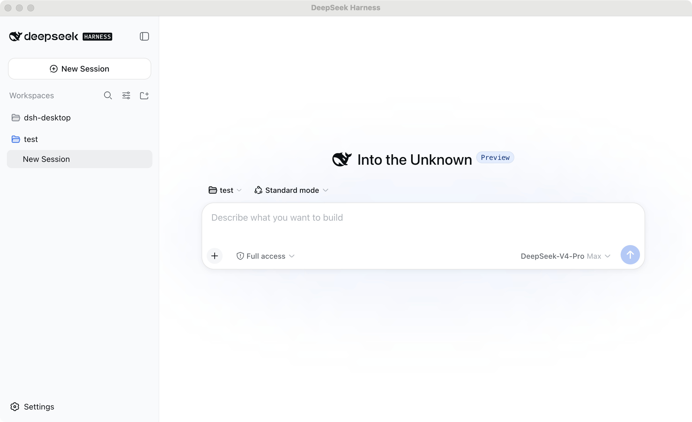

# DSH Desktop

[](https://github.com/DolphinMiner/dsh-desktop/actions/workflows/ci.yml)
[](LICENSE)

[简体中文](README.zh-CN.md)

An independent, community-built macOS desktop host for the official
[DeepSeek Harness](https://github.com/deepseek-ai/deepseek-harness) Web UI.

> [!IMPORTANT]
> This is an early Apple Silicon MVP. Builds are currently unsigned and not
> notarized. DSH Desktop is not affiliated with or endorsed by DeepSeek.

## Preview



This first MVP intentionally keeps the architecture narrow:

1. Electron starts a pinned, bundled `@deepseek-ai/dsh` process.
2. Harness binds to `127.0.0.1` on an operating-system-selected port.
3. Electron waits for the official readiness URL and loads it in a native window.
4. Electron stops the Harness process when the application quits.

The project does not fork or modify the Harness agent loop, model adapters,
session storage, tools, or Web UI.

Cross-platform reuse comes from Electron plus the official React Web UI, not
React Native. The same host code can later target Windows and Linux; using
React Native would require rewriting the Harness interface.

## Architecture

```text
Electron main process
  -> starts the bundled dsh CLI as a managed child process
  -> waits for its loopback health endpoint
  -> loads the official Harness Web UI in a sandboxed window
  -> stops the child process during application shutdown
```

Harness remains the source of truth for agents, model calls, tools, sessions,
approvals, and persistence. The Electron layer owns only the desktop window,
process lifecycle, navigation policy, and a small loading-page IPC bridge.

## Requirements

- An Apple Silicon Mac for the current packaging target
- Node.js 24
- npm 10 or newer

## Development

Install dependencies from the lockfile:

```bash
nvm use
npm ci
```

Run the application:

```bash
npm start
```

Run checks:

```bash
npm run check
```

Build an unpacked Apple Silicon application:

```bash
npm run package:mac
```

Open the result:

```bash
open "release/mac-arm64/DSH Desktop.app"
```

Build unsigned DMG and ZIP artifacts:

```bash
npm run dist:mac
```

Signing and notarization are deliberately outside the first MVP.

## Current Limitations

- Apple Silicon is the only packaged architecture.
- Releases are not yet code signed or notarized.
- Releases do not yet have an automatic updater.
- Native notifications, Dock integration, Keychain storage, and Computer Use
  are not implemented.

## Local Data

Harness data is stored under Electron's application data directory:

```text
~/Library/Application Support/DSH Desktop/harness
```

Runtime logs are stored under:

```text
~/Library/Logs/DSH Desktop/harness.log
```

The Electron layer never reads or copies model credentials. The official
Harness credential provider stores them inside its own data directory. Moving
credentials into macOS Keychain is a possible later desktop integration.

## Security Model

Harness listens only on `127.0.0.1` with an operating-system-selected port.
The Electron renderer is sandboxed, Node.js integration is disabled, external
navigation is blocked, and desktop IPC handlers accept calls only from the
exact bundled loading page. See [SECURITY.md](SECURITY.md) for private
vulnerability reporting. Treat Harness logs and local data as sensitive.

## Packaging Note

The MVP packages application resources as normal files instead of an ASAR
archive. Harness discovers plugins dynamically and maintains filesystem
symlinks to their package directories; those links cannot target Electron's
virtual ASAR filesystem reliably. ASAR is a packaging format, not a security
boundary.

## Desktop Integration Boundary

The current application needs no custom Harness plugin. Harness already owns
workspace selection, local tools, approvals, session persistence, directory
selection, and opening generated files with macOS applications.

A future desktop integration plugin should only adapt capabilities that exist
because the UI is inside Electron, such as Dock badges, native notifications,
application menus, Keychain-backed credentials, and desktop updates. It should
expose a small allowlisted API to Harness rather than duplicating the agent or
granting browser code unrestricted Electron IPC access.

For example, a notification integration would have only two small halves:

1. A Harness plugin listens for a completed run and emits a typed
   `desktop.notify` request.
2. Electron validates that request and calls the macOS notification API.

The plugin does not own prompts, sessions, model calls, tools, or persistence.
Those remain in Harness as the single source of truth.

Computer Use would be a separate, larger integration. It would need explicit
screen-capture and accessibility permissions plus tightly scoped screenshot,
click, and keyboard operations with user approval. Merely displaying Harness
inside Electron does not grant those capabilities.

## Contributing

See [CONTRIBUTING.md](CONTRIBUTING.md) before opening a pull request. Desktop
host bugs belong here; agent, model, tool, session, and upstream Web UI issues
belong in the [DeepSeek Harness repository](https://github.com/deepseek-ai/deepseek-harness).

Release history is recorded in [CHANGELOG.md](CHANGELOG.md). This project is
licensed under [Apache-2.0](LICENSE); bundled dependency notices are in
[THIRD_PARTY_NOTICES.md](THIRD_PARTY_NOTICES.md).
