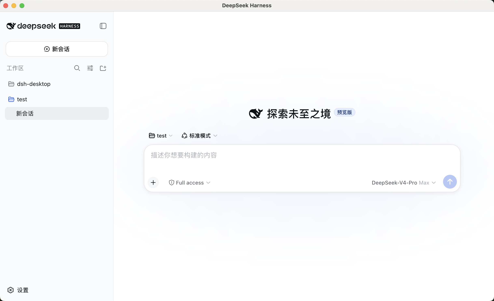

# DSH Desktop

[](https://github.com/DolphinMiner/dsh-desktop/actions/workflows/ci.yml)
[](LICENSE)

[简体中文](README.zh-CN.md)

An independent, community-built macOS desktop product for the official
[DeepSeek Harness](https://github.com/deepseek-ai/deepseek-harness) Web UI.

> [!IMPORTANT]
> This is an early Apple Silicon preview. Builds are currently unsigned and not
> notarized. DSH Desktop is not affiliated with or endorsed by DeepSeek.

## Preview



The desktop host intentionally keeps the architecture narrow:

1. Electron starts a pinned, bundled `@deepseek-ai/dsh` process.
2. A product-owned `desktop` profile composes the official base and Web bundles
   with independently versioned desktop Cordis plugins.
3. Harness binds to `127.0.0.1` on an operating-system-selected port.
4. Electron waits for the official readiness URL and loads it in a native window.
5. A versioned, allowlisted child-process channel provides native capabilities
   and securely supervised external connections.
6. Electron stops the Harness process and pending desktop work on quit.

The project does not fork or modify the Harness agent loop, model adapters,
session storage, tools, or Web UI.

## Connections

The Connections page is contributed through the official Harness client-slot
API. v0.3 supports multiple Linear workspaces through either an API key or an
OAuth application configured by the distributor.

- API keys, OAuth access tokens, refresh tokens, and PKCE recovery state are
  encrypted with Electron `safeStorage`, backed by macOS Keychain.
- Harness receives an ephemeral loopback MCP URL. Electron adds the bearer
  credential only on the final request to Linear.
- Read-only connections use Linear's read-only MCP endpoint. Potential writes
  require one-shot Harness approval and are not automatically replayed after an
  ambiguous result.
- The UI reports connecting, connected, expired, error, and disconnected states
  from the desktop host rather than assuming a connection is healthy.

API-key connections work without additional build configuration. To enable the
OAuth button for local development, configure a Linear OAuth application whose
callback is `dsh-desktop://oauth/linear/callback`, then start with:

```bash
DSH_DESKTOP_LINEAR_CLIENT_ID=your_client_id npm start
```

`DSH_DESKTOP_LINEAR_CLIENT_SECRET` is optional for clients configured to use
PKCE without a secret. Never commit either value.

Cross-platform reuse comes from Electron plus the official React Web UI, not
React Native. The same host code can later target Windows and Linux; using
React Native would require rewriting the Harness interface.

## Architecture

```text
Electron main process
  -> bootstraps and starts the bundled dsh CLI with --profile desktop
  -> waits for its loopback health endpoint
  -> brokers typed, allowlisted native capabilities
  -> loads the official Harness Web UI in a sandboxed window
  -> stops the child process during application shutdown
```

Harness remains the source of truth for agents, model calls, tools, sessions,
approvals, and persistence. The Electron layer owns the desktop window, process
lifecycle, navigation policy, native notifications, and capability enforcement.
The Harness renderer never receives direct Electron or Node.js access.

## Requirements

- An Apple Silicon Mac for the current packaging target
- Node.js 24
- npm 10 or newer

## Development

Install dependencies from the lockfile:

```bash
nvm use
npm ci
```

Run the application:

```bash
npm start
```

Run checks:

```bash
npm run check
```

Build an unpacked Apple Silicon application:

```bash
npm run package:mac
```

Open the result:

```bash
open "release/mac-arm64/DSH Desktop.app"
```

Build unsigned DMG and ZIP artifacts:

```bash
npm run dist:mac
```

Signing and notarization are deliberately outside the first MVP.

## Current Limitations

- Apple Silicon is the only packaged architecture.
- Releases are not yet code signed or notarized.
- Releases do not yet have an automatic updater.
- Linear OAuth requires a separately configured Linear application.
- Dock activity integration and Computer Use are not yet implemented.

## Local Data

Harness data is stored under Electron's application data directory:

```text
~/Library/Application Support/DSH Desktop/harness
```

Desktop connection metadata and encrypted credential envelopes are stored under:

```text
~/Library/Application Support/DSH Desktop/desktop
```

Runtime logs are stored under:

```text
~/Library/Logs/DSH Desktop/harness.log
```

The Electron layer never reads or copies model credentials. The official
Harness credential provider stores those inside its own data directory. Linear
credentials are owned by the desktop connection broker and encrypted through
macOS Keychain; plaintext credentials are not written to profile YAML, logs, or
browser storage.

## Security Model

Harness and the credential-bearing MCP proxy listen only on `127.0.0.1` with
operating-system-selected ports.
The Electron renderer is sandboxed, Node.js integration is disabled, external
navigation is blocked, and desktop IPC handlers accept calls only from the
exact bundled loading page or the active loopback Harness origin. See
[SECURITY.md](SECURITY.md) for private vulnerability reporting. Treat Harness
logs and local data as sensitive.

## Packaging Note

The MVP packages application resources as normal files instead of an ASAR
archive. Harness discovers plugins dynamically and maintains filesystem
symlinks to their package directories; those links cannot target Electron's
virtual ASAR filesystem reliably. ASAR is a packaging format, not a security
boundary.

## Desktop Integration Boundary

Harness already owns workspace selection, local tools, approvals, session
persistence, and generated files. The desktop integration plugin only adapts
capabilities that exist because Harness is running inside Electron. It exposes
a small allowlisted API rather than duplicating the agent or granting browser
code unrestricted Electron IPC access.

The first integration, native notifications, has two small halves:

1. A Harness plugin listens for a completed run and emits a typed
   `desktop.notify` request.
2. Electron validates that request and calls the macOS notification API.

The protocol validates message versions, methods, payloads, responses, request
IDs, timeouts, cancellation, and disconnects. The plugin does not own prompts,
sessions, model calls, tools, or persistence; those remain in Harness as the
single source of truth.

Computer Use would be a separate, larger integration. It would need explicit
screen-capture and accessibility permissions plus tightly scoped screenshot,
click, and keyboard operations with user approval. Merely displaying Harness
inside Electron does not grant those capabilities.

## Contributing

See [CONTRIBUTING.md](CONTRIBUTING.md) before opening a pull request. Desktop
host bugs belong here; agent, model, tool, session, and upstream Web UI issues
belong in the [DeepSeek Harness repository](https://github.com/deepseek-ai/deepseek-harness).

Release history is recorded in [CHANGELOG.md](CHANGELOG.md). This project is
licensed under [Apache-2.0](LICENSE); bundled dependency notices are in
[THIRD_PARTY_NOTICES.md](THIRD_PARTY_NOTICES.md).
